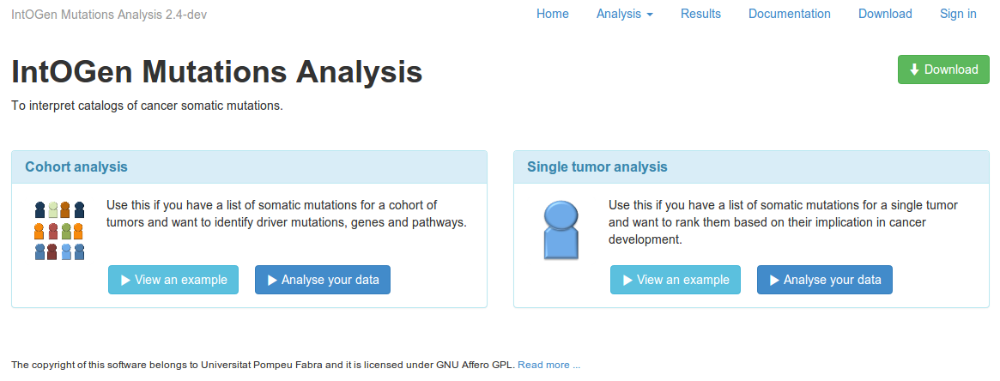
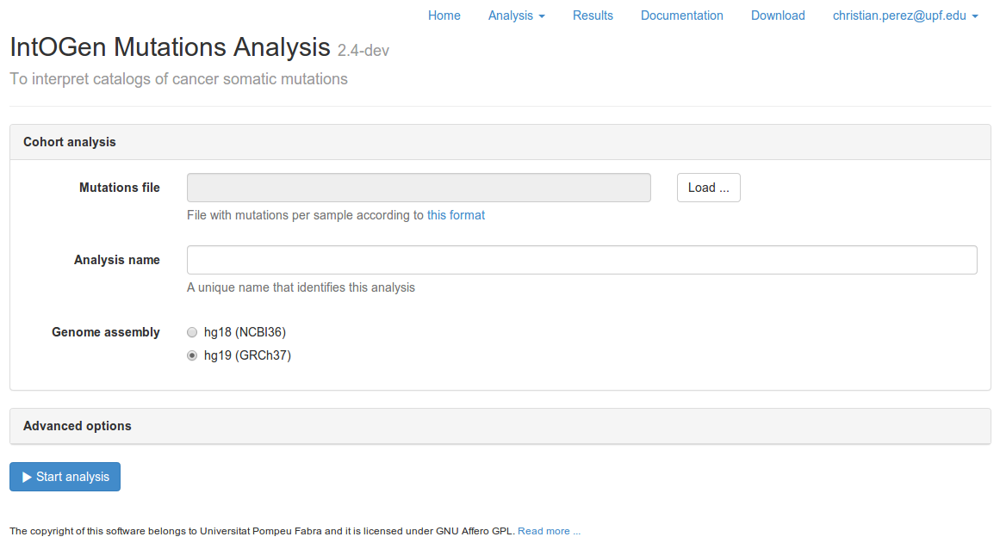
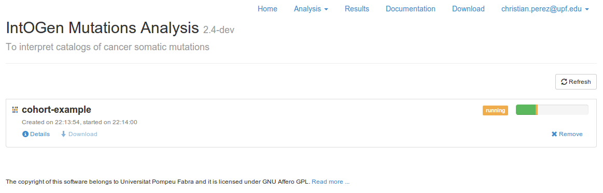
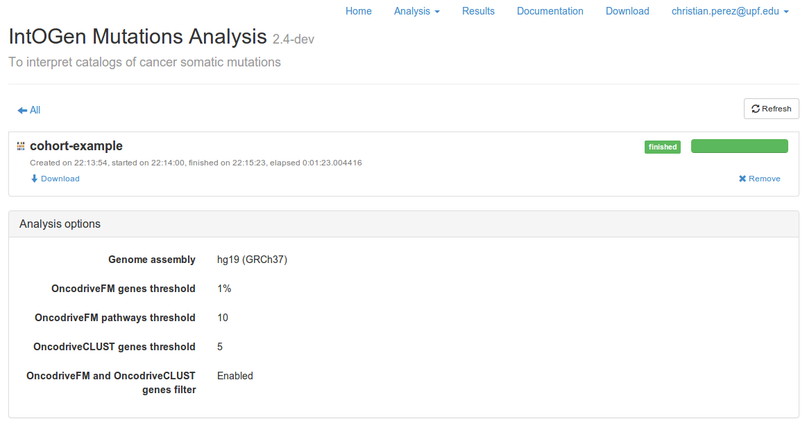
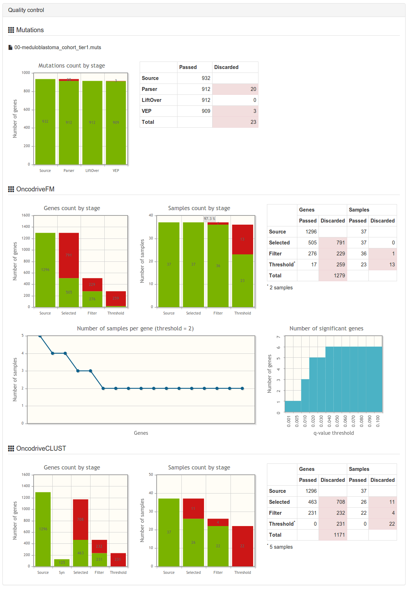

Web interface
=============

If you don't feel confident with the unix terminal you can use the web interface that allows to perform analysis and explore the results using your preferred browser (Mozilla Firefox, Safari, and so on). You can run it locally in your computer and just run it by your own, or it could be run in your intranet or in a public server to allow many people to use it inside your organization.

The `IntOGen Mutations <http://www.intogen.org/mutations>`_ web site is an example of what can be done with IntOGen Mutations and you can use it for evaluation purposes.

Authentication is managed using `Mozilla Persona <https://login.persona.org/>`_ which makes very intuitive to sign up and start using it.

There are 5 main sections:

* Home_
* Analysis_
* Results_
* Documentation_
* Download_

Home
----

From the **home** page the user can start the analysis of some examples or his/her own data. Currently there are two types of analysis available.

Analysis
--------

The **analysis** page have a form to upload the data, configure the analysis and start running it. There is a different form for each type of analysis.

Results
-------

The **results** page allows to track the progress of the execution. Once the analysis is finished, you can download the results in a zip file, or start browsing the data.

You can click on the Details link to see more details about the analysis. There you will find information about the parameters of the analysis, error messages in case that there is any error and quality control plots and tables.

Documentation
-------------

The **documentation** page contains this help documentation.

Download
--------

The **download** page contains the download section of the documentation.

What if I don't want to use Mozilla Persona ?
---------------------------------------------

There is already implemented a primitive system to sign up/sign in with the traditional validation email without using external services such as *Mozilla Persona* but it has not been activated yet. If you are interested on it please let us know and we will consider to include it as an option.