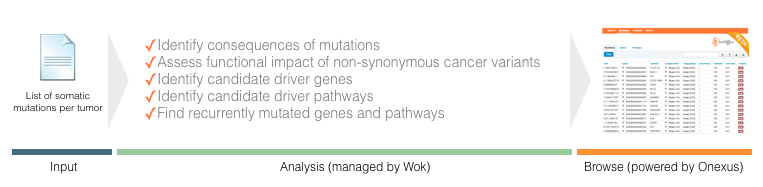

Introduction
============

Thanks to rapid advances in sequencing technologies, cancer research projects are now able to sequence the genome (or exome) of tumors and obtain catalogs of cancer somatic mutations. However, identifying which of these mutations are important for the development of the tumor is a challenging task. IntOGen provides a complete and easy-to-run pipeline to interpret this data.

The input of IntOGen Mutations pipeline is a list of somatic mutations per tumor. This list is processed to identify consequences of mutations, to assess the functional impact of non-synonymous cancer variants, to identify candidate driver genes and pathways and to find recurrently mutated genes and pathways.

The input is first processed with Ensembl Variant Effect Predictor to identify the consequences of mutations on transcripts and regulatory regions and to obtain the scores of SIFT and PolyPhen 2 (PPH2). Mutation Assessor (MA) scores are also obtained from precalculated values we previously downloaded. Next, the recurrence of mutations per gene and per pathway are computed. SIFT, PPH2 and MA scores are used to assess the Functional Impact Bias of genes and pathways using OncodriveFM, which assigns a P value to each gene and pathway indicating its likelihood to be a cancer driver. SIFT, PPH2 and MA are also used by transFIC, which outputs the functional impact of each cancer somatic mutation. All these results are then prepared to be browsed.

.. todo::

	Include OncodriveCLUST information in the previous paragraph.

.. todo::

	Include a figure depicting everything explained.

.. _license:

License
-------

Copyright (C) 2012-2013 `Universitat Pompeu Fabra <www.upf.edu>`_

The source code is licensed under the `UPF Free Source Code License <http://bg.upf.edu/licenses/intogen-mutations-analysis-license.txt>`_.

This document is licensed under a `Creative Commons Attribution-NonCommercial-ShareAlike 3.0 Unported License <http://creativecommons.org/licenses/by-nc-sa/3.0/deed.en_GB>`_ |CreativeCommons-BY-NC-SA|

.. |CreativeCommons-BY-NC-SA| image:: images/CreativeCommons-BY-NC-SA.png
